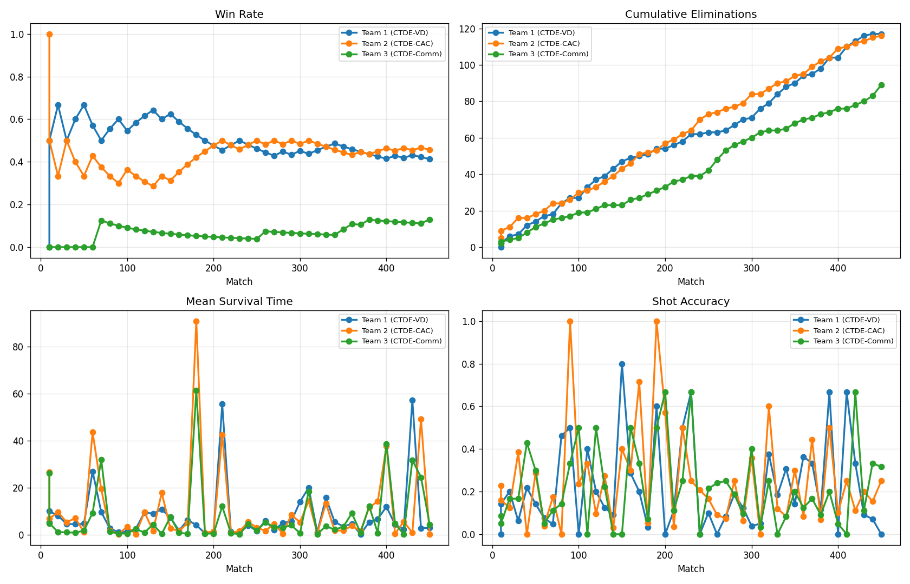

# 8. Results

All numbers in this chapter are recomputed from the artefacts in the repository or from a command
quoted alongside them.

The chapter has two halves, and they are not interchangeable:

* **[§ Replicated study](#replicated-study)** — 5 seeds per experiment at 1,000,000 steps, measured by
  held-out greedy evaluation of the final policy, produced under the corrected heading controller. This
  is the primary evidence and the only part that supports a conclusion.
* **[§ Historical single-seed runs](#historical-single-seed-runs)** — the two 100,000-step runs the
  repository originally shipped, measured during training from a single seed, under the defective control
  law [A-1](11_code_audit.md#turn-control-defect) before it was fixed. Reported because they are the
  artefacts in `data/` and because their re-analysis is what motivated the study.

Both halves are recomputed by scripts rather than transcribed: `scripts/report_study.py` emits the study
tables from `results/study/per_seed_metrics.csv`.

## 8.1 Historical single-seed runs <a name="historical-single-seed-runs"></a>

### Experiment 1 — CTE vs DTE vs CTDE

Source: `data/metrics/summary.json` (463 matches played; snapshot taken at match 460).

| Team | Paradigm | Win rate | Elim./match | Mean survival (s) | Shot accuracy | Hits | Misses |
|---|---|---:|---:|---:|---:|---:|---:|
| Team 1 | CTE | 27.39 % | 1.72 | 9.63 | 8.10 % | 790 | 8,959 |
| Team 2 | DTE | 25.43 % | 1.84 | 8.59 | 8.13 % | 848 | 9,587 |
| Team 3 | **CTDE** | **47.17 %** | **3.42** | **9.93** | **12.84 %** | 1,571 | 10,663 |

### Experiment 2 — CTDE-VD vs CTDE-CAC vs CTDE-Comm

Source: [`ctde_arena/data/metrics/summary.json`](../ctde_arena/data/metrics/summary.json) (456 matches
played; snapshot at match 450). Versioned.

| Team | Paradigm | Win rate | Elim./match | Mean survival (s) | Shot accuracy | Hits | Misses |
|---|---|---:|---:|---:|---:|---:|---:|
| Team 1 | CTDE-VD | 40.67 % | 2.50 | 10.20 | 11.29 % | 1,125 | 8,843 |
| Team 2 | **CTDE-CAC** | **42.89 %** | **2.63** | 9.83 | **12.33 %** | 1,184 | 8,417 |
| Team 3 | CTDE-Comm | 16.44 % | 1.96 | 7.47 | 12.14 % | 883 | 6,390 |



*The four-panel dashboard regenerated from the versioned `team_match_metrics.csv`. Note that the
win-rate panel is a **cumulative** ratio over recorded matches only, so the visible convergence near
0.41/0.43 is regression to the mean of a 46-sample estimate, not a training effect.*

## 8.2 The metric set is rank-deficient

`eliminations_per_match` is not an independent measurement. Because every hit eliminates exactly one
agent and every elimination comes from a hit,

\[
\text{elim/match} \;=\; \text{shots/match} \times \text{shot accuracy}
\]

holds to the reported precision for all six teams (verified: CTE \(21.19 \times 0.0810 = 1.72\) against
a reported 1.72; CTDE-Comm \(16.16 \times 0.1214 = 1.96\) against 1.96). Four headline columns
therefore carry three degrees of freedom. Any interpretation that treats "eliminations" and "accuracy"
as separate evidence is double-counting.

## 8.3 Decomposing the elimination gap

Expressing each team relative to a reference arm separates *how much a team shoots* from *how well it
converts*:

**Experiment 1**, relative to CTE:

| Team | Shot volume | Accuracy | Product |
|---|---:|---:|---:|
| DTE | ×1.070 | ×1.003 | ×1.073 |
| CTDE | ×1.255 | ×1.585 | **×1.989** |

CTDE's advantage is genuinely two-factor: it fires 26 % more often **and** converts 59 % better.

**Experiment 2**, relative to CTDE-VD:

| Team | Shot volume | Accuracy | Product |
|---|---:|---:|---:|
| CTDE-CAC | ×0.963 | ×1.093 | ×1.052 |
| CTDE-Comm | **×0.730** | **×1.076** | ×0.785 |

> **This contradicts the intuitive reading of the headline table.** CTDE-Comm is *not* a worse shot —
> its accuracy (12.14 %) is marginally higher than CTDE-VD's (11.29 %) and within 0.2 points of
> CTDE-CAC's. Its entire elimination deficit is a **firing-volume deficit**: it shoots 27 % less often.
> Counterfactually, at CTDE-VD's shot volume with its own accuracy, CTDE-Comm would produce
> **2.69 eliminations per match**, ahead of both other arms (2.50 and 2.63).

The consequence for RQ2 is narrow but real: whatever is wrong with the communication arm, it is not
aiming. The deficit is in the learned `shoot` bit — a policy-level decision — or in staying alive long
enough to shoot (Comm's mean survival is 7.47 s against 9.83–10.20 s, and a dead agent fires nothing).
Those two explanations are not separable with the data available, because shot counts are only
aggregated per team per match and are not conditioned on alive-time. A per-agent shots-per-second-of-
life rate would separate them and is listed as open work in
[§ Code audit](11_code_audit.md#open-work-suggested-measurements).

## 8.4 Statistical significance

Computed on the **46 recorded matches per team** (the most conservative defensible sample; Wilson score
intervals, two-proportion \(z\)-tests).

### Experiment 1

| Team | Wins / recorded | Win rate | 95 % CI |
|---|---:|---:|---|
| Team 1 (CTE) | 14 / 46 | 0.304 | [0.191, 0.448] |
| Team 2 (DTE) | 13 / 46 | 0.283 | [0.173, 0.425] |
| Team 3 (CTDE) | 19 / 46 | 0.413 | [0.283, 0.557] |

| Comparison | \(z\) | \(p\) | Verdict |
|---|---:|---:|---|
| CTE vs DTE | +0.23 | 0.819 | not significant |
| CTE vs CTDE | −1.09 | 0.277 | **not significant** |
| DTE vs CTDE | −1.31 | 0.189 | **not significant** |

> **No pairwise difference in Experiment 1 is statistically distinguishable on the recorded matches.**
> The intervals are 0.25–0.27 wide, i.e. ±13 percentage points, while the claimed gaps are 11–17 points.

### Experiment 2

| Team | Wins / recorded | Win rate | 95 % CI |
|---|---:|---:|---|
| Team 1 (VD) | 19 / 46 | 0.413 | [0.283, 0.557] |
| Team 2 (CAC) | 21 / 46 | 0.457 | [0.322, 0.598] |
| Team 3 (Comm) | 6 / 46 | 0.130 | [0.061, 0.257] |

| Comparison | \(z\) | \(p\) | Verdict |
|---|---:|---:|---|
| VD vs CAC | −0.42 | 0.674 | **not significant** |
| VD vs Comm | +3.05 | 0.002 | significant (survives Bonferroni at 0.0167) |
| CAC vs Comm | +3.43 | 0.001 | significant (survives Bonferroni at 0.0167) |

### Sensitivity to the independence assumption

If instead the full cumulative denominators (460 / 450 matches) are treated as independent Bernoulli
trials, every gap in Experiment 1 and the VD-vs-CAC gap remain as before but the CTDE and Comm gaps
become strongly significant (\(p < 10^{-5}\)). That assumption is **false** — the matches are played by
policies that change every match, and exactly one of three teams wins each match, so outcomes are
negatively correlated within a match. The 46-match treatment is reported as the primary result and the
cumulative treatment as an upper bound on what the data can support.

**The one robust finding in this repository is that CTDE-Comm loses to both non-communicating CTDE
variants.** Everything else is directional at best.

## 8.5 Drift: is the ranking a learning effect? <a name="drift"></a>

Splitting each team's 46 recorded matches at the midpoint separates "the architecture is better" from
"the architecture learned to be better".

### Experiment 1 — win rate by segment

| Team | All 46 | First 23 | Last 23 | Last 10 | Change |
|---|---:|---:|---:|---:|---:|
| Team 1 (CTE) | 0.304 | 0.304 | 0.304 | 0.200 | **+0.000** |
| Team 2 (DTE) | 0.283 | 0.304 | 0.261 | 0.200 | −0.043 |
| Team 3 (CTDE) | 0.413 | 0.391 | 0.435 | 0.600 | +0.043 |

> **Experiment 1 shows essentially no learning trend.** The ordering CTDE > CTE ≈ DTE is already present
> in the first 23 recorded matches (which begin at match 10). Either the policies converged within a few
> thousand steps, or the ordering is not a learning effect at all. The available artefacts cannot
> distinguish these, because the only training-time snapshot is a single `training_log` entry at step
> 50,587.

### Experiment 2 — win rate by segment

| Team | All 46 | First 23 | Last 23 | Last 10 | Change |
|---|---:|---:|---:|---:|---:|
| Team 1 (VD) | 0.413 | 0.478 | 0.348 | 0.200 | **−0.130** |
| Team 2 (CAC) | 0.457 | 0.478 | 0.435 | 0.500 | −0.043 |
| Team 3 (Comm) | 0.130 | 0.043 | 0.217 | 0.300 | **+0.174** |

Here there is a clear pattern, and it is the one the project hypothesised: **CTDE-Comm starts worst by a
wide margin (4.3 % of its first-half recorded matches) and improves the most (+17.4 points)**, while
both non-communicating arms drift downward. This is consistent with the "learn to act and to
communicate simultaneously" account — but note it is also consistent with a cyclic population dynamic,
since the three teams co-adapt and a decline in VD is partly explained by Comm's improvement against it.

Shot accuracy and eliminations per team are far more stable than win rate across the same split
(e.g. Experiment 2 accuracy: VD 0.161 → 0.126, CAC 0.135 → 0.136, Comm 0.145 → 0.126), which is what
one expects when the *competitive* outcome moves but the *component skill* does not.

## 8.6 What MLflow actually contains

The versioned export [`ctde_arena/data/mlflow_export/`](../ctde_arena/data/mlflow_export/) holds the
48 metric points that reached the tracker. The 100,000-step run contributed **one** point, at step
50,793:

| Team | Win rate @50,793 | Final cumulative | Δ |
|---|---:|---:|---:|
| CTDE-VD | 0.4039 | 0.4067 | +0.003 |
| CTDE-CAC | 0.4433 | 0.4289 | −0.014 |
| CTDE-Comm | 0.1527 | 0.1644 | +0.012 |

The mid-training snapshot already reproduces the final ordering to within 1.4 points, which corroborates
§ 8.5's conclusion that Experiment 2's ranking is largely established early — with the exception of
Comm's upward drift, which the single point cannot resolve.

The 5,000-step smoke run (`457ce1e8`, logged every 1,000 steps) reaches win rates of 0.250 / 0.417 /
0.333 for VD / CAC / Comm by step 3,958 — under 4 % of the versioned budget. It is a configuration
check, not a result, and it is the only multi-point curve that exists anywhere in this project.

## 8.7 Baseline behaviour from random initialisation

To provide a reference point for "how much of this is learning", 60 headless matches were run from
freshly initialised networks with no checkpoint loading:

```
60 headless matches (random-policy init, no checkpoints): {'wipeout': 50, 'timeout': 10}
duration min=4.7s median=25.6s max=90.1s
```

Random policies already end 83 % of matches by wipeout, with a median duration of 25.6 s. The trained
policies produce *shorter* recorded matches (median 9.1 s in Experiment 1, 7.6 s in Experiment 2).
Whether that reflects faster killing or faster dying cannot be separated with these metrics — and the
ambiguity matters, because the reward function pays +0.015 per step of survival
([§ 4.4.1](04_mdp_formalisation.md#441-reward-scale-versus-horizon)).

## 8.8 Summary of answers

| Question | Answer supported by the versioned evidence |
|---|---|
| **RQ1** — does CTDE beat CTE and DTE? | **Directionally yes, statistically unproven.** CTDE leads on every metric, and the lead decomposes into both more shooting and better conversion. But no pairwise comparison reaches significance on the 46 recorded matches, and the ordering is present from the first recorded match, so it is not demonstrably a *learning* result. |
| **RQ2** — which CTDE variant wins? | **CAC ≈ VD, and both beat Comm.** The VD/CAC gap (2.2 points cumulative, 4.4 points on recorded matches) is well inside noise. The Comm gap is significant under Bonferroni correction and is the only finding this repository can defend. Mechanically, Comm's deficit is reduced firing volume, not worse aim. |
| **RQ3** — is it stable? | **Not tested.** One seed, one run per experiment, no replication, no held-out evaluation, and unseeded minibatch shuffling. |
