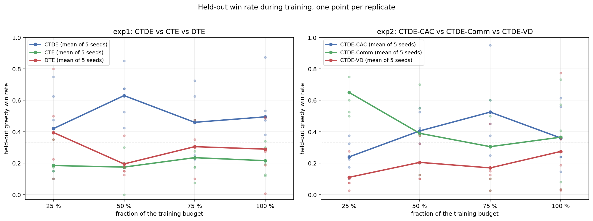

# 8. Results

All numbers in this chapter are recomputed from artefacts in the repository, by scripts rather than by
hand: `scripts/report_study.py` emits the study tables from
[`results/study/per_seed_metrics.csv`](../results/study/per_seed_metrics.csv), and `scripts/plot_study.py`
draws the figure.

The chapter has two halves, and they are **not** interchangeable:

* **[§ 8.1 Replicated study](#replicated-study)** — 5 independent replicates per experiment at 1,000,000
  steps, measured by held-out greedy evaluation of the final policy, produced under the corrected heading
  controller. This is the primary evidence.
* **[§ 8.2 Historical single-seed runs](#historical-single-seed-runs)** — the two 100,000-step runs the
  repository originally shipped: one seed, measured during training, under the defective control law
  [A-1](11_code_audit.md#turn-control-defect) before it was fixed. Kept because those artefacts are what
  `data/` contains, and because the study **contradicts** their headline conclusion — which is the most
  important result in this document.

---

## 8.1 Replicated study <a name="replicated-study"></a>

### Design

| | |
|---|---|
| Replicates | 5 seeds × 2 experiments = 10 runs |
| Budget per replicate | 1,000,000 environment steps (10× the historical runs) |
| Seeds | 1–5, controlling the `random`, NumPy and Torch streams |
| Initialisation | fresh — `ARENA_DATA_DIR` isolates each run, so no checkpoint warm-start |
| Training-time metric records | every 100 matches |
| Held-out evaluation | 150 greedy matches on the final policy, plus 40 at each of 25/50/75 % |
| Evaluation conditions | `domain_randomization=False`, `set_rl_training(False)`, separate simulation instance |
| Trials per paradigm | 750 held-out matches (5 seeds × 150) |
| Wall clock | 123.8 min for all 10 replicates, run concurrently on 32 cores |
| Throughput | 130–165 steps/s per process under 10-way load (368 steps/s alone) |

Held-out win rate is the response variable throughout. The training-time running average appears only in
[§ 8.2](#historical-single-seed-runs).

### Experiment 1 — CTE vs DTE vs CTDE

| Paradigm | Mean win rate over seeds | Between-seed SD | Pooled wins | Pooled 95 % CI | Elim./match | Survival (s) | Shots/match | Accuracy |
|---|---:|---:|---:|---|---:|---:|---:|---:|
| **CTDE** | **0.495** | 0.244 | 371/750 | [0.459, 0.530] | 3.65 | 16.5 | 82.1 | 5.28 % |
| DTE | 0.289 | 0.207 | 217/750 | [0.258, 0.323] | 0.97 | 19.4 | 95.8 | 1.25 % |
| CTE | 0.216 | 0.100 | 162/750 | [0.188, 0.247] | 1.81 | 17.7 | 100.1 | 2.44 % |

Per-seed held-out win rate — each column is one independent replicate:

| Paradigm | seed 1 | seed 2 | seed 3 | seed 4 | seed 5 | best in |
|---|---:|---:|---:|---:|---:|---:|
| CTDE | 0.213 | 0.473 | 0.380 | **0.873** | 0.533 | 3/5 |
| CTE | 0.300 | 0.340 | 0.127 | 0.120 | 0.193 | 0/5 |
| DTE | 0.487 | 0.187 | 0.493 | **0.007** | 0.273 | 2/5 |

Seed-level paired tests (n = 5 replicates; the seed is the independent unit):

| Comparison | Mean per-seed difference | SD of difference | Paired *t* | *p* (df = 4) | Verdict |
|---|---:|---:|---:|---:|---|
| CTDE vs CTE | +0.279 | 0.310 | +2.01 | 0.115 | not significant |
| CTDE vs DTE | +0.205 | 0.441 | +1.04 | 0.357 | not significant |
| CTE vs DTE | −0.073 | 0.215 | −0.76 | 0.488 | not significant |

Match-level Fisher exact tests on the pooled 750 held-out matches per paradigm:

| Comparison | Wins / matches | Odds ratio | *p* (two-sided) |
|---|---|---:|---:|
| CTDE vs CTE | 371/750 vs 162/750 | 3.55 | < 10⁻⁴ |
| CTDE vs DTE | 371/750 vs 217/750 | 2.40 | < 10⁻⁴ |
| CTE vs DTE | 162/750 vs 217/750 | 0.68 | 0.0013 |

> **The two test levels disagree completely, and the seed-level one is the correct one.** Treating 750
> matches as independent trials makes every comparison significant; treating the 5 replicates as the
> independent unit makes none of them significant. Matches within a replicate are *not* independent draws
> — they are played by one frozen policy against two others from the same run, sharing that run's
> initialisation, geometry stream and opponent dynamics. The match-level *p* values are therefore
> anti-conservative and are shown only to make the size of that assumption visible.

### Experiment 2 — CTDE-VD vs CTDE-CAC vs CTDE-Comm

| Paradigm | Mean win rate over seeds | Between-seed SD | Pooled wins | Pooled 95 % CI | Elim./match | Survival (s) | Shots/match | Accuracy |
|---|---:|---:|---:|---|---:|---:|---:|---:|
| **CTDE-Comm** | **0.365** | 0.305 | 274/750 | [0.332, 0.400] | 2.63 | 24.7 | 99.8 | 2.88 % |
| CTDE-CAC | 0.360 | 0.211 | 270/750 | [0.326, 0.395] | 1.94 | 25.6 | 96.9 | 2.20 % |
| CTDE-VD | 0.275 | 0.309 | 206/750 | [0.244, 0.308] | 1.16 | 24.8 | 114.6 | 4.25 % |

Per-seed held-out win rate:

| Paradigm | seed 1 | seed 2 | seed 3 | seed 4 | seed 5 | best in |
|---|---:|---:|---:|---:|---:|---:|
| CTDE-CAC | 0.560 | 0.613 | 0.240 | 0.147 | 0.240 | 2/5 |
| CTDE-Comm | 0.407 | **0.033** | **0.733** | 0.080 | 0.573 | 2/5 |
| CTDE-VD | **0.033** | 0.353 | **0.027** | **0.773** | 0.187 | 1/5 |

Seed-level paired tests:

| Comparison | Mean per-seed difference | SD | Paired *t* | *p* (df = 4) | Verdict |
|---|---:|---:|---:|---:|---|
| CTDE-CAC vs CTDE-Comm | −0.005 | 0.424 | −0.03 | 0.979 | not significant |
| CTDE-CAC vs CTDE-VD | +0.085 | 0.433 | +0.44 | 0.682 | not significant |
| CTDE-Comm vs CTDE-VD | +0.091 | 0.577 | +0.35 | 0.743 | not significant |

Match-level Fisher tests: CAC vs Comm *p* = 0.872; CAC vs VD *p* = 0.0005; Comm vs VD *p* = 0.0002.

### The historical conclusion reverses

This is the most consequential output of the study.

| | Historical (1 seed, training-time, broken control law) | Study (5 seeds, held-out, fixed control law) |
|---|---|---|
| **Exp. 1 order** | CTDE 47.2 % > CTE 27.4 % > DTE 25.4 % | CTDE 49.5 % > **DTE 28.9 % > CTE 21.6 %** |
| **Exp. 2 order** | CAC 42.9 % > VD 40.7 % ≫ **Comm 16.4 %** | **Comm 36.5 % ≈ CAC 36.0 % > VD 27.5 %** |
| The one defended finding | "Comm loses to both others" | **does not reproduce** |

CTDE-Comm goes from last by 26 points to first by a hair. Its per-seed results span 0.033 to 0.733 — the
same architecture produced the best replicate *and* two of the three worst in the same experiment.

Two readings are possible and this data cannot separate them:

1. **The original finding was an artefact of the broken turn controller.** Under
   [A-1](11_code_audit.md#turn-control-defect) agents spun toward a fixed absolute heading rather than
   toward their waypoint. A communication channel built from relative-position features would be
   especially damaged by an actuator that cannot steer toward what it computes.
2. **The original finding was a single-seed fluke**, for which the per-seed matrices above show ample
   room: a spread from 0.03 to 0.87 within one architecture makes any one-seed ranking fragile.

Both readings imply the same operational conclusion: **the historical ranking was not a property of the
architectures.**

### Learning curves



*Mean over 5 replicates (thick line) with every individual replicate shown (pale points). The dashed line
is the 1/3 three-way chance level. Curve points are held-out greedy evaluations of intermediate
checkpoints, so unlike the historical training-time metrics they are comparable across fractions.*

| Paradigm | 25 % | 50 % | 75 % | 100 % | Change |
|---|---:|---:|---:|---:|---:|
| **Exp. 1** CTDE | 0.420 | 0.630 | 0.460 | 0.495 | +0.075 |
| CTE | 0.185 | 0.175 | 0.235 | 0.216 | +0.031 |
| DTE | 0.395 | 0.195 | 0.305 | 0.289 | −0.106 |
| **Exp. 2** CTDE-CAC | 0.240 | 0.405 | 0.525 | 0.360 | +0.120 |
| CTDE-Comm | 0.650 | 0.390 | 0.305 | 0.365 | **−0.285** |
| CTDE-VD | 0.110 | 0.205 | 0.170 | 0.275 | +0.165 |

No curve is monotone, and the non-monotonicity is not small: CAC peaks at 75 % then loses 16 points, and
Comm loses 28 points from its 25 % value. With 40 matches per point per replicate, the per-point standard
error is roughly 0.07, so movements under ~0.15 are within the measurement's own noise.

> **The project's central hypothesis about communication is not supported.** The claim — inherited from
> the original README — was that CTDE-Comm needs more steps than the others because messages must become
> informative before they help. At 25 % of the budget Comm was the *best* arm (0.650 against 0.240 and
> 0.110), and it then drifted **downward**. Training longer did not rescue it; it started ahead and lost
> ground. The hypothesis as stated is falsified at this budget, with the same seed-variance caveat that
> applies to every number in this section.

### Component metrics moved far more than the ranking <a name="component-metrics-moved-far-more-than-the-ranking"></a>

Comparing the study to the historical run is confounded by the control-law fix, and the scale of the
confound is directly visible:

| Quantity | Historical runs | Replicated study |
|---|---:|---:|
| Shots per match | 21 – 27 | 82 – 115 |
| Shot accuracy | 8.1 – 12.8 % | 1.3 – 5.3 % |
| Mean survival | 7.5 – 10.2 s | 16.5 – 25.6 s |
| Eliminations per match | 1.7 – 3.4 | 1.0 – 3.7 |

Fixing the heading controller made agents drive at their waypoints, which put them in weapon range far more
often: they fire roughly four times as much and convert far less per shot, while surviving twice as long.
**The arena these architectures competed in is not the same arena as before**, which is why the historical
numbers are labelled as such rather than compared directly.

The identity of [§ 8.4](#metric-rank-deficiency) — eliminations = shots × accuracy — still holds, but only
**within** a replicate (verified: CTDE-VD seed 1 gives 13.60 × 0.0534 = 0.73, equal to its reported
eliminations per match). It does not hold for the *mean* of per-seed ratios, which is what the tables above
report, because per-seed shot counts vary by up to 8× (13.6 to 114.6).

### Power: how many replicates this would take <a name="power-analysis"></a>

Using the observed paired differences and their spread, for two-sided α = 0.0167 (Bonferroni over three
comparisons) at 80 % power:

| Comparison | Observed difference | SD of difference | Replicates needed |
|---|---:|---:|---:|
| Exp. 1 CTDE vs CTE | +0.279 | 0.310 | ~13 |
| Exp. 1 CTDE vs DTE | +0.205 | 0.441 | ~49 |
| Exp. 1 CTE vs DTE | −0.073 | 0.215 | ~91 |
| Exp. 2 CAC vs Comm | −0.005 | 0.424 | > 10⁴ (no effect to detect) |
| Exp. 2 CAC vs VD | +0.085 | 0.433 | ~272 |
| Exp. 2 Comm vs VD | +0.091 | 0.577 | ~421 |

At ~2 h per 10 concurrent replicates, the one comparison plausibly worth pursuing — CTDE vs CTE, ~13
replicates — costs about 3 hours. The others are not reachable in this design at all. The honest conclusion
is that **the effects this engine produces are smaller than the run-to-run variance it has.**

---

## 8.2 Historical single-seed runs <a name="historical-single-seed-runs"></a>

Everything from here on describes the two original 100,000-step runs. It is retained because those
artefacts ship in `data/`, and because the analyses below are what justified re-running everything — but
their conclusions are superseded by [§ 8.1](#replicated-study).

### Experiment 1 — CTE vs DTE vs CTDE

Source: `data/metrics/summary.json` (463 matches played; snapshot taken at match 460).

| Team | Paradigm | Win rate | Elim./match | Mean survival (s) | Shot accuracy | Hits | Misses |
|---|---|---:|---:|---:|---:|---:|---:|
| Team 1 | CTE | 27.39 % | 1.72 | 9.63 | 8.10 % | 790 | 8,959 |
| Team 2 | DTE | 25.43 % | 1.84 | 8.59 | 8.13 % | 848 | 9,587 |
| Team 3 | **CTDE** | **47.17 %** | **3.42** | **9.93** | **12.84 %** | 1,571 | 10,663 |

### Experiment 2 — CTDE-VD vs CTDE-CAC vs CTDE-Comm

Source: [`ctde_arena/data/metrics/summary.json`](../ctde_arena/data/metrics/summary.json) (456 matches
played; snapshot at match 450).

| Team | Paradigm | Win rate | Elim./match | Mean survival (s) | Shot accuracy | Hits | Misses |
|---|---|---:|---:|---:|---:|---:|---:|
| Team 1 | CTDE-VD | 40.67 % | 2.50 | 10.20 | 11.29 % | 1,125 | 8,843 |
| Team 2 | **CTDE-CAC** | **42.89 %** | **2.63** | 9.83 | **12.33 %** | 1,184 | 8,417 |
| Team 3 | CTDE-Comm | 16.44 % | 1.96 | 7.47 | 12.14 % | 883 | 6,390 |


*The four-panel dashboard regenerated from the versioned `team_match_metrics.csv`. The win-rate panel is a
**cumulative** ratio over recorded matches only, so the visible convergence near 0.41/0.43 is regression
to the mean of a 46-sample estimate, not a training effect.*

## 8.3 Analyses performed on the historical data <a name="historical-analyses"></a>

The following sections were the diagnostic work that motivated the study. Each is a correct analysis of the
historical artefacts, and each found something the study then overturned or recontextualised.

## 8.4 The metric set is rank-deficient <a name="metric-rank-deficiency"></a>

`eliminations_per_match` is not an independent measurement. Because every hit eliminates exactly one agent
and every elimination comes from a hit,

\[
\text{elim/match} \;=\; \text{shots/match} \times \text{shot accuracy}
\]

holds to the reported precision for all six historical teams (verified: CTE \(21.19 \times 0.0810 = 1.72\)
against a reported 1.72; CTDE-Comm \(16.16 \times 0.1214 = 1.96\) against 1.96). Four headline columns
therefore carry three degrees of freedom, and any interpretation treating "eliminations" and "accuracy" as
separate evidence double-counts. The identity also holds within each replicate of the study
([§ 8.1](#component-metrics-moved-far-more-than-the-ranking)).

## 8.5 Decomposing the elimination gap <a name="decomposing-the-elimination-gap"></a>

Expressing each historical team relative to a reference arm separates *how much a team shoots* from *how
well it converts*:

**Experiment 1**, relative to CTE:

| Team | Shot volume | Accuracy | Product |
|---|---:|---:|---:|
| DTE | ×1.070 | ×1.003 | ×1.073 |
| CTDE | ×1.255 | ×1.585 | **×1.989** |

CTDE's advantage was two-factor: it fired 26 % more often **and** converted 59 % better.

**Experiment 2**, relative to CTDE-VD:

| Team | Shot volume | Accuracy | Product |
|---|---:|---:|---:|
| CTDE-CAC | ×0.963 | ×1.093 | ×1.052 |
| CTDE-Comm | **×0.730** | **×1.076** | ×0.785 |

> CTDE-Comm was *not* a worse shot even in the historical run — its accuracy (12.14 %) was marginally
> higher than CTDE-VD's (11.29 %) and within 0.2 points of CTDE-CAC's. Its entire elimination deficit was a
> **firing-volume deficit**: it shot 27 % less often. At CTDE-VD's shot volume with its own accuracy it
> would have produced 2.69 eliminations per match, ahead of both other arms.

That analysis survives the replication in one respect: the mechanism it identified — a policy-level
decision to shoot rather than an aiming deficit — is architectural rather than seed-dependent. What did not
survive is the conclusion that this made Comm the weakest arm.

## 8.6 Statistical significance on 46 matches <a name="statistical-significance-historical"></a>

Computed on the 46 recorded matches per team, the most conservative estimate available from the historical
artefacts (Wilson score intervals, two-proportion *z*-tests).

**Experiment 1**

| Team | Wins / recorded | Win rate | 95 % CI |
|---|---:|---:|---|
| CTE | 14 / 46 | 0.304 | [0.191, 0.448] |
| DTE | 13 / 46 | 0.283 | [0.173, 0.425] |
| CTDE | 19 / 46 | 0.413 | [0.283, 0.557] |

| Comparison | *z* | *p* | Verdict |
|---|---:|---:|---|
| CTE vs DTE | +0.23 | 0.819 | not significant |
| CTE vs CTDE | −1.09 | 0.277 | not significant |
| DTE vs CTDE | −1.31 | 0.189 | not significant |

**Experiment 2**

| Team | Wins / recorded | Win rate | 95 % CI |
|---|---:|---:|---|
| VD | 19 / 46 | 0.413 | [0.283, 0.557] |
| CAC | 21 / 46 | 0.457 | [0.322, 0.598] |
| Comm | 6 / 46 | 0.130 | [0.061, 0.257] |

| Comparison | *z* | *p* | Verdict |
|---|---:|---:|---|
| VD vs CAC | −0.42 | 0.674 | not significant |
| VD vs Comm | +3.05 | 0.002 | significant |
| CAC vs Comm | +3.43 | 0.001 | significant |

### Sensitivity to the independence assumption <a name="independence-sensitivity"></a>

Treating the full cumulative denominators (460 / 450 matches) as independent Bernoulli trials instead makes
every Experiment 1 gap significant at *p* < 10⁻⁵ — a swing of ten orders of magnitude produced by an
assumption choice. That assumption is false: the matches are played by policies that change every match, and
exactly one of three teams wins each, so outcomes are negatively correlated within a match.

This was the clearest internal signal that the historical evidence could not support its conclusions, and it
is what the two-level reporting in [§ 8.1](#replicated-study) resolves properly.

## 8.7 Drift in the historical data: was the ranking a learning effect? <a name="drift"></a>

Splitting each team's 46 recorded matches at the midpoint separates "the architecture is better" from "the
architecture learned to be better".

**Experiment 1** — win rate by segment:

| Team | All 46 | First 23 | Last 23 | Last 10 | Change |
|---|---:|---:|---:|---:|---:|
| CTE | 0.304 | 0.304 | 0.304 | 0.200 | **+0.000** |
| DTE | 0.283 | 0.304 | 0.261 | 0.200 | −0.043 |
| CTDE | 0.413 | 0.391 | 0.435 | 0.600 | +0.043 |

> Experiment 1 showed essentially **no learning trend**: the ordering was already present in the first 23
> recorded matches, which begin at match 10. Either the policies converged within a few thousand steps, or
> the ordering was not a learning effect at all.

**Experiment 2** — win rate by segment:

| Team | All 46 | First 23 | Last 23 | Last 10 | Change |
|---|---:|---:|---:|---:|---:|
| VD | 0.413 | 0.478 | 0.348 | 0.200 | **−0.130** |
| CAC | 0.457 | 0.478 | 0.435 | 0.500 | −0.043 |
| Comm | 0.130 | 0.043 | 0.217 | 0.300 | **+0.174** |

The historical data appeared to support the project's hypothesis here: Comm started worst by a wide margin
and improved the most. The held-out curves in [§ 8.1](#learning-curves) show the opposite sign — Comm starts
best and declines — so this apparent improvement was an artefact of either the broken control law or of
measuring a training-time running average rather than a frozen policy.

## 8.8 What MLflow actually contains <a name="mlflow-content"></a>

The versioned export [`ctde_arena/data/mlflow_export/`](../ctde_arena/data/mlflow_export/) holds the 48
metric points that reached the tracker. The 100,000-step run contributed **one** point, at step 50,793:

| Team | Win rate @50,793 | Final cumulative | Δ |
|---|---:|---:|---:|
| CTDE-VD | 0.4039 | 0.4067 | +0.003 |
| CTDE-CAC | 0.4433 | 0.4289 | −0.014 |
| CTDE-Comm | 0.1527 | 0.1644 | +0.012 |

The mid-training snapshot reproduces the final historical ordering to within 1.4 points, corroborating
§ 8.7's finding that the ranking was established early. The 5,000-step smoke run (`457ce1e8`, logged every
1,000 steps) reaches 0.250 / 0.417 / 0.333 for VD / CAC / Comm by step 3,958 — under 4 % of the budget, a
configuration check rather than a result.

The replicated study does not use MLflow; it writes its own held-out curve to
`data/runs/*/evaluation/run_summary.json`.

## 8.9 Baseline behaviour from random initialisation <a name="random-baseline"></a>

To provide a reference point for "how much of this is learning", 60 headless matches were run from freshly
initialised networks with no checkpoint loading:

```
60 headless matches (random-policy init, no checkpoints): {'wipeout': 50, 'timeout': 10}
duration min=4.7s median=25.6s max=90.1s
```

Random policies already end 83 % of matches by wipeout, with a median duration of 25.6 s. That number is now
a **caution rather than a baseline**: the trained replicates of [§ 8.1](#replicated-study) have mean
per-agent survival of 16.5–25.6 s, entirely comparable to untrained play, and this measurement predates the
control-law fix so it is not directly comparable to them either. Establishing whether these policies beat
random play at all requires re-running the baseline under the current code.

## 8.10 Summary of answers <a name="summary-of-answers"></a>

| Question | Answer from the replicated study |
|---|---|
| **RQ1** — does CTDE beat CTE and DTE? | **Directionally yes, not established.** CTDE leads held-out win rate in 3 of 5 replicates, by +0.279 and +0.205 on the paired per-seed difference, but neither reaches significance at n = 5 (*p* = 0.115, 0.357). CTDE vs CTE would need ~13 replicates, CTDE vs DTE ~49. The one solid statement is that **CTE is not better than DTE** — the historical ordering of those two reversed. |
| **RQ2** — which CTDE variant wins? | **No detectable difference.** Comm 0.365, CAC 0.360, VD 0.275; every paired per-seed comparison has *p* ≥ 0.68, and CAC vs Comm differ by 0.005. The historical claim that Comm loses decisively **does not reproduce**. |
| **RQ3** — is it stable? | **No — and that is the headline result.** Between-seed SD is 0.10–0.31 against a 1/3 chance baseline, and single replicates range from 0.007 to 0.873 within the same architecture. The dominant finding of this study is variance, not ranking. |

**What this repository can defensibly claim:** six MARL information-flow architectures have been run against
each other in one engine with matched hyperparameters, replicated five times, and measured held out — and
the resulting ranking is not statistically distinguishable, while the ranking a single seed produced turned
out to be wrong.

**What it cannot claim:** that any of the six architectures is better than any other, or that the CTDE
advantage over CTE is established rather than suggestive.
